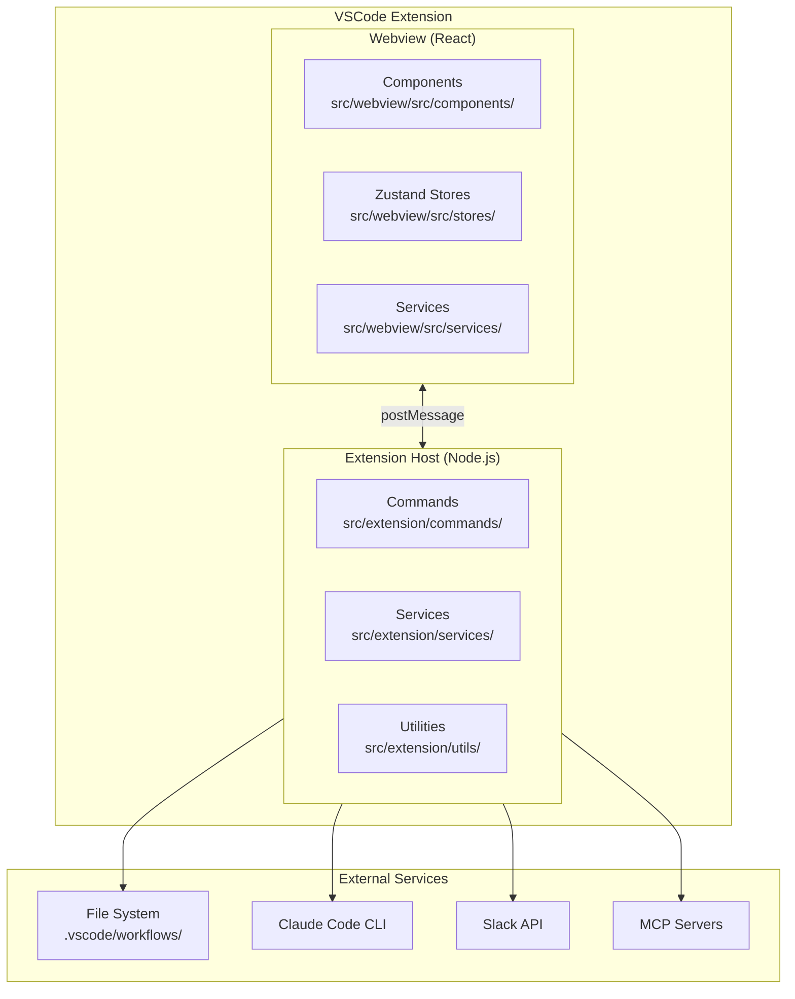
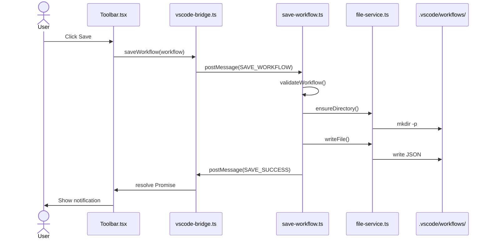
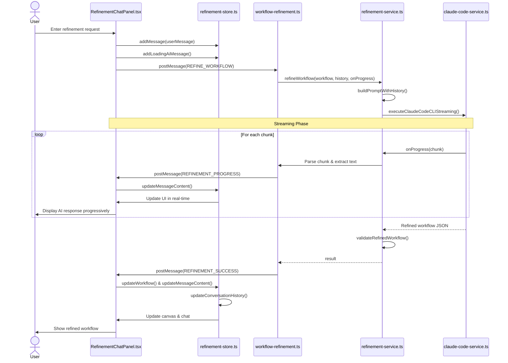
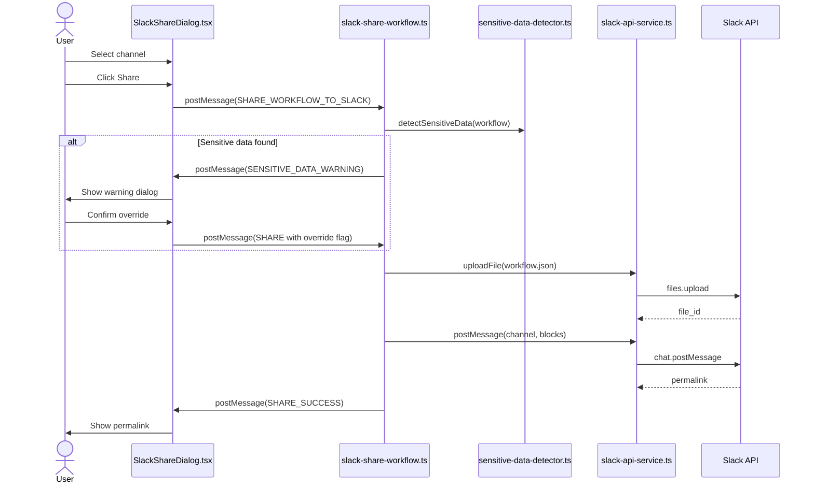
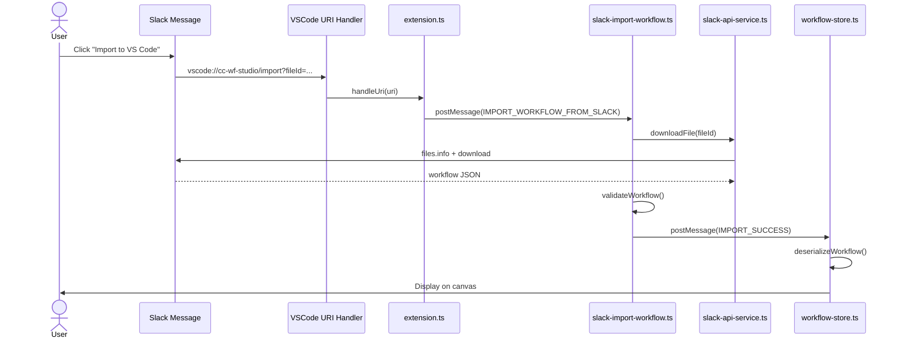
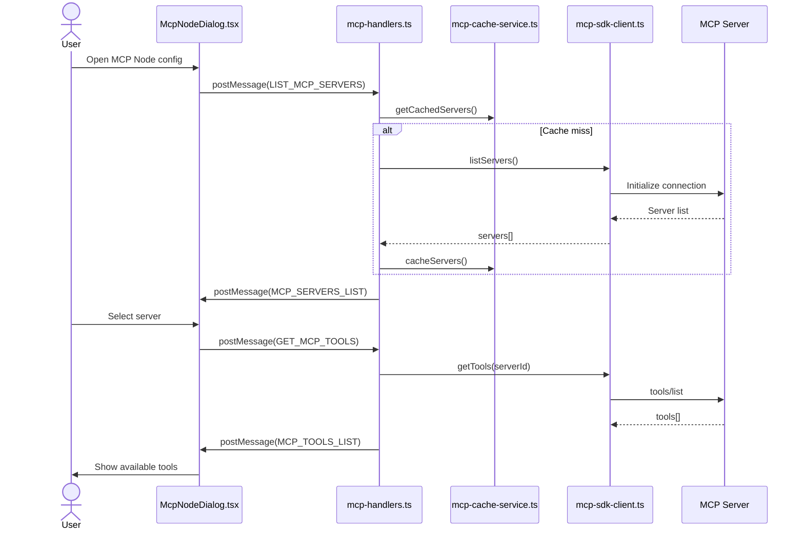

# cc-wf-studio Development Guidelines

Auto-generated from all feature plans. Last updated: 2025-11-01

## Active Technologies
- ローカルファイルシステム (`.vscode/workflows/*.json`, `.claude/skills/*.md`, `.claude/commands/*.md`) (001-cc-wf-studio)
- TypeScript 5.3 (VSCode Extension Host), React 18.2 (Webview UI) (001-node-types-extension)
- ローカルファイルシステム (`.vscode/workflows/*.json`) (001-node-types-extension)
- TypeScript 5.3 (Extension Host & Webview shared types), React 18.2 (Webview UI) (001-ai-workflow-generation)
- File system (workflow schema JSON in resources/, generated workflows in canvas state) (001-ai-workflow-generation)
- TypeScript 5.3.0 (001-skill-node)
- File system (SKILL.md files in `~/.claude/skills/` and `.claude/skills/`), workflow JSON files in `.vscode/workflows/` (001-skill-node)
- TypeScript 5.3 (Extension Host), React 18.2 (Webview UI) (001-ai-skill-generation)
- File system (existing SKILL.md files in `~/.claude/skills/` and `.claude/skills/`, workflow-schema.json in resources/) (001-ai-skill-generation)
- Workflow JSON files in `.vscode/workflows/` directory (conversation history embedded in workflow metadata) (001-ai-workflow-refinement)
- TypeScript 5.3.0 (VSCode Extension Host), TypeScript/React 18.2 (Webview UI) + VSCode Extension API 1.80.0+, React 18.2, React Flow (visual canvas), Zustand (state management), child_process (Claude Code CLI execution) (001-mcp-node)
- Workflow JSON files in `.vscode/workflows/` directory, Claude Code MCP configuration (user/project/enterprise scopes) (001-mcp-node)
- TypeScript 5.3.0 (VSCode Extension Host), TypeScript/React 18.2 (Webview UI) + VSCode Extension API 1.80.0+, React 18.2, React Flow (visual canvas), Zustand (state management), existing MCP SDK client services (001-mcp-natural-language-mode)
- Workflow JSON files in `.vscode/workflows/` directory (extends existing McpNodeData structure) (001-mcp-natural-language-mode)
- TypeScript 5.3 (VSCode Extension Host), React 18.2 (Webview UI), @slack/web-api 7.x, Node.js http (OAuth callback server), VSCode Secret Storage (001-slack-workflow-sharing)
- Workflow JSON files in `.vscode/workflows/` directory, Slack message attachments (workflow storage), VSCode Secret Storage (OAuth tokens) (001-slack-workflow-sharing)

- TypeScript 5.x (VSCode Extension Host), React 18.x (Webview UI) (001-cc-wf-studio)

## Project Structure

```text
src/
tests/
```

## Development Workflow & Commands

### Commit Message Guidelines

**IMPORTANT: Keep commit messages simple for squash merge workflow.**

#### Format
```
<type>: <subject>

<optional body with bullet points>
```

#### Example
```
fix: add missing MCP node definition to workflow schema

- Added 'mcp' to supportedNodeTypes
- Added complete MCP node type definition with field constraints
- Fixes MCP_INVALID_PARAMETERS and MCP_INVALID_MODE validation errors
```

#### Rules
- **Subject**: 50 characters max, imperative mood, no period
- **Body**: 3-5 bullet points max, "what" changed only
- **Details**: Put "why" and "how" in PR description, NOT commit message

#### Types
- `feat:` - New feature (minor version bump)
- `fix:` - Bug fix (patch version bump)
- `improvement:` - Minor enhancement to existing feature (patch version bump)
- `docs:` - Documentation only
- `refactor:` - Code refactoring
- `chore:` - Build/tooling changes

#### What to Avoid
❌ Long explanations (Problem/Solution/Impact sections)
❌ Multiple paragraphs
❌ Code blocks
❌ Test results with checkboxes

✅ Simple 3-5 line summary of changes

### Code Quality Checks (Required Before Commit/PR)

**Always run these commands in the following order after code modifications:**

```bash
npm run format  # Auto-format code with Biome
npm run lint    # Check for linting issues
npm run check   # Run all Biome checks (lint + format verification)
npm run build   # Build extension and webview (verify compilation)
```

### Command Execution Timing

#### During Development
1. **After code modification**:
   ```bash
   npm run format && npm run lint && npm run check
   ```
   - Fixes formatting issues automatically
   - Identifies linting problems
   - Verifies code quality standards

2. **Before manual E2E testing**:
   ```bash
   npm run build
   ```
   - Compiles TypeScript and builds extension
   - Required for testing changes in VSCode

3. **Before git commit**:
   ```bash
   npm run format && npm run lint && npm run check
   ```
   - Ensures all code quality standards are met
   - Prevents committing code with linting/formatting issues

#### Testing
- **Unit/Integration tests**: Not required (manual E2E testing only)
- **Manual E2E testing**: Required for all feature changes and bug fixes
  - Run `npm run build` first
  - Test in VSCode Extension Development Host

## Version Update Procedure

**IMPORTANT: Version updates and releases are fully automated via Semantic Release and GitHub Actions.**

### Automated Release Process

This project uses **Semantic Release** with **GitHub Actions** for fully automated versioning, changelog generation, and publishing.

#### Release Workflow (`.github/workflows/release.yml`)

**Trigger**: Push to `production` branch

**Automated Steps**:
1. **Semantic Release** analyzes commit messages and determines version bump
2. **Version Update**: Updates `package.json`, `src/webview/package.json`, `src/webview/package-lock.json`
3. **Changelog Generation**: Automatically updates `CHANGELOG.md`
4. **Git Commit**: Creates release commit with message `chore(release): ${version} [skip ci]`
5. **GitHub Release**: Creates GitHub release with release notes
6. **VSIX Build**: Builds and packages the extension
7. **VSIX Upload**: Uploads `.vsix` file to GitHub release
8. **Version Sync**: Merges version changes from `production` to `main` branch

#### Commit Message Convention (Conventional Commits)

The version bump is determined by commit message prefixes:

- `feat:` → **Minor** version bump (e.g., 2.0.0 → 2.1.0)
- `fix:` → **Patch** version bump (e.g., 2.1.0 → 2.1.1)
- `perf:` → **Patch** version bump
- `revert:` → **Patch** version bump
- **BREAKING CHANGE** in commit body → **Major** version bump (e.g., 2.1.0 → 3.0.0)
- `docs:`, `style:`, `chore:`, `refactor:`, `test:`, `build:`, `ci:` → No release

**Example commit messages**:
```bash
feat: add MCP node integration
fix: resolve parameter validation issue
feat!: redesign workflow export format (BREAKING CHANGE)
```

#### Changelog Sections (`.releaserc.json`)

Generated changelog groups commits by type:

- **Features** (`feat:`)
- **Bug Fixes** (`fix:`)
- **Performance Improvements** (`perf:`)
- **Reverts** (`revert:`)
- **Code Refactoring** (`refactor:`) - visible
- **Documentation** (`docs:`) - visible
- **Styles** (`style:`) - hidden
- **Tests** (`test:`) - hidden
- **Build System** (`build:`) - hidden
- **Continuous Integration** (`ci:`) - hidden
- **Miscellaneous Chores** (`chore:`) - hidden

#### Automated File Updates

Semantic Release automatically updates:
- `package.json` (root)
- `src/webview/package.json`
- `src/webview/package-lock.json`
- `CHANGELOG.md`

These files are committed with `[skip ci]` to prevent infinite loops.

#### Manual Version Updates (NOT RECOMMENDED)

**DO NOT manually update version numbers unless absolutely necessary.**

If manual update is required:
1. Update `package.json` (root directory) - `"version"` field
2. Update `src/webview/package.json` - `"version"` field
3. Run `cd src/webview && npm install` to update `package-lock.json`
4. Commit all three files together

Manual version updates will be overwritten by the next automated release.

## Code Style

TypeScript 5.x (VSCode Extension Host), React 18.x (Webview UI): Follow standard conventions

## Recent Changes
- 001-mcp-natural-language-mode: Added TypeScript 5.3.0 (VSCode Extension Host), TypeScript/React 18.2 (Webview UI) + VSCode Extension API 1.80.0+, React 18.2, React Flow (visual canvas), Zustand (state management), existing MCP SDK client services
- 001-mcp-node: Added TypeScript 5.3.0 (VSCode Extension Host), TypeScript/React 18.2 (Webview UI) + VSCode Extension API 1.80.0+, React 18.2, React Flow (visual canvas), Zustand (state management), child_process (Claude Code CLI execution)


<!-- MANUAL ADDITIONS START -->

## Architecture Sequence Diagrams

このセクションでは、cc-wf-studioの主要なデータフローをMermaid形式のシーケンス図で説明します。

### アーキテクチャ概要



### ワークフロー保存フロー



### AI ワークフロー改善フロー (Refinement)



### Slack ワークフロー共有フロー



### Slack ワークフローインポートフロー (Deep Link)



### MCP サーバー/ツール取得フロー



---

## AI-Assisted Skill Node Generation (Feature 001-ai-skill-generation)

### Key Files and Components

#### Extension Host Services
- **src/extension/services/skill-relevance-matcher.ts**
  - Calculates relevance scores between user descriptions and Skills using keyword matching
  - `tokenize()`: Removes stopwords, filters by min length (3 chars)
  - `calculateSkillRelevance()`: Formula: `score = |intersection| / sqrt(|userTokens| * |skillTokens|)`
  - `filterSkillsByRelevance()`: Filters by threshold (0.6), limits to 20, prefers project scope
  - No new library dependencies (per user constraint)

- **src/extension/commands/ai-generation.ts** (Enhanced)
  - Scans personal + project Skills in parallel (`Promise.all`)
  - Filters Skills by relevance to user description
  - Constructs AI prompt with "Available Skills" section (JSON format)
  - Resolves `skillPath` post-generation for AI-generated Skill nodes
  - Marks missing Skills as `validationStatus: 'missing'`

- **src/extension/utils/validate-workflow.ts** (Extended)
  - `validateSkillNode()`: Validates required fields, name format, length constraints
  - Error codes: SKILL_MISSING_FIELD, SKILL_INVALID_NAME, SKILL_NAME_TOO_LONG, etc.
  - Integrated into `validateAIGeneratedWorkflow()` flow

#### Resources
- **resources/workflow-schema.json** (Updated)
  - Added Skill node type documentation (~1.5KB addition)
  - Instructions for AI: "Use when user description matches Skill's purpose"
  - Field descriptions: name, description, scope, skillPath (auto-resolved), validationStatus
  - File size: 16.5KB (within tolerance)

### Message Flow
```
Webview (AiGenerationDialog)
  → postMessage(GENERATE_WORKFLOW)
  → Extension (ai-generation.ts)
  → scanAllSkills() + loadWorkflowSchema() (parallel)
  → filterSkillsByRelevance(userDescription, availableSkills)
  → constructPrompt(description, schema, filteredSkills)
  → ClaudeCodeService.executeClaudeCodeCLI()
  → Parse & resolveSkillPaths(workflow, availableSkills)
  → Validate (including Skill nodes)
  → postMessage(GENERATION_SUCCESS | GENERATION_FAILED)
  → Webview (workflow-store.addGeneratedWorkflow())
```

### Key Constraints
- Max 20 Skills in AI prompt (prevent timeout)
- Relevance threshold: 0.3 (30%) - tested 0.5 but 0.3 provides better recall without sacrificing quality
- Keyword matching: O(n+m) complexity
- Duplicate handling: Project scope preferred over personal
- Generation timeout: 90 seconds

### Error Handling
- Skill not found → `validationStatus: 'missing'`
- Skill file malformed → `validationStatus: 'invalid'`
- All errors logged to "Claude Code Workflow Studio" Output Channel

### Design Decisions & Lessons Learned

**Phase 5 (User Skill Selection) - Rejected**

During development, we attempted to implement a UI feature allowing users to manually select which Skills to include/exclude in AI generation. This was intended to prevent timeouts when users have many Skills installed.

**Why it was rejected:**
- **AI generation control has inherent limitations**: The AI prompt is a "suggestion" not a "command"
- **Unpredictable behavior**: Even when Skills are excluded from the prompt, the AI may still generate Skill nodes based on its own interpretation of the user's description
- **Poor UX**: Users selecting "don't use this Skill" would experience confusion when the AI uses it anyway
- **Uncontrollable AI behavior**: The final decision of which nodes to generate belongs to the AI, not the prompt engineering

**Key lesson:**
> Do not implement user-facing features that promise control over AI behavior that cannot be guaranteed. AI generation is inherently probabilistic, and features requiring deterministic outcomes should be avoided.

**Alternative approaches for timeout prevention:**
- Dynamic timeout adjustment based on Skill count
- Adaptive relevance threshold tuning (e.g., 0.3 → 0.5 for high Skill counts)
- Maintain strict MAX_SKILLS_IN_PROMPT limit (currently 20)

---

## AI-Assisted Workflow Generation (Feature 001-ai-workflow-generation)

### Key Files and Components

#### Extension Host Services
- **src/extension/services/claude-code-service.ts**
  - Executes Claude Code CLI via child_process.spawn()
  - Handles timeout (30s default), error mapping (COMMAND_NOT_FOUND, TIMEOUT, etc.)
  - Includes comprehensive logging to VSCode Output Channel

- **src/extension/services/schema-loader-service.ts**
  - Loads workflow-schema.json from resources/ directory
  - Implements in-memory caching for performance
  - Provides schema to AI for context during generation

- **src/extension/commands/ai-generation.ts**
  - Main command handler for GENERATE_WORKFLOW messages from Webview
  - Orchestrates: schema loading → CLI execution → parsing → validation
  - Sends success/failure messages back to Webview with execution metrics

- **src/extension/utils/validate-workflow.ts**
  - Validates AI-generated workflows against VALIDATION_RULES
  - Checks node count (<50), connection validity, required fields
  - Returns structured validation errors for user feedback

#### Webview Components
- **src/webview/src/services/ai-generation-service.ts**
  - Bridge between Webview UI and Extension Host
  - Sends GENERATE_WORKFLOW messages via postMessage
  - Returns Promise that resolves to workflow or AIGenerationError

- **src/webview/src/components/dialogs/AiGenerationDialog.tsx**
  - Modal dialog for user description input (max 2000 chars)
  - Handles loading states, error display, success notifications
  - Fully internationalized (5 languages: en, ja, ko, zh-CN, zh-TW)
  - Keyboard shortcuts: Ctrl/Cmd+Enter (generate), Esc (cancel)

#### Resources
- **resources/workflow-schema.json**
  - Comprehensive schema documentation for AI context
  - Documents all 7 node types (Start, End, Prompt, SubAgent, AskUserQuestion, IfElse, Switch)
  - Includes validation rules and 3 example workflows
  - Size: <10KB (optimized for token efficiency)
  - **IMPORTANT**: Included in VSIX package (not excluded by .vscodeignore)

#### Documentation
- **docs/schema-maintenance.md**
  - Maintenance guide for workflow-schema.json
  - Synchronization procedures between TypeScript types and JSON schema
  - Update workflows, validation rules mapping, common tasks
  - File size optimization guidelines (target <10KB, max 15KB)

### Message Flow
```
Webview (AiGenerationDialog)
  → postMessage(GENERATE_WORKFLOW)
  → Extension (ai-generation.ts)
  → ClaudeCodeService.executeClaudeCodeCLI()
  → Parse & Validate
  → postMessage(GENERATION_SUCCESS | GENERATION_FAILED)
  → Webview (workflow-store.addGeneratedWorkflow())
```

### Error Handling
- All errors mapped to specific error codes for i18n
- Comprehensive logging to "Claude Code Workflow Studio" Output Channel
- Execution time tracking for all operations (success and failure)

### Testing Notes
- T052-T054: Manual testing scenarios (simple/medium/complex workflows, error scenarios)
- T055: VSCode Output Channel logging implemented ✓
- Unit/integration tests deferred (T011-T015, T019, T023, T028, T032, T035, T040)

<!-- MANUAL ADDITIONS END -->
