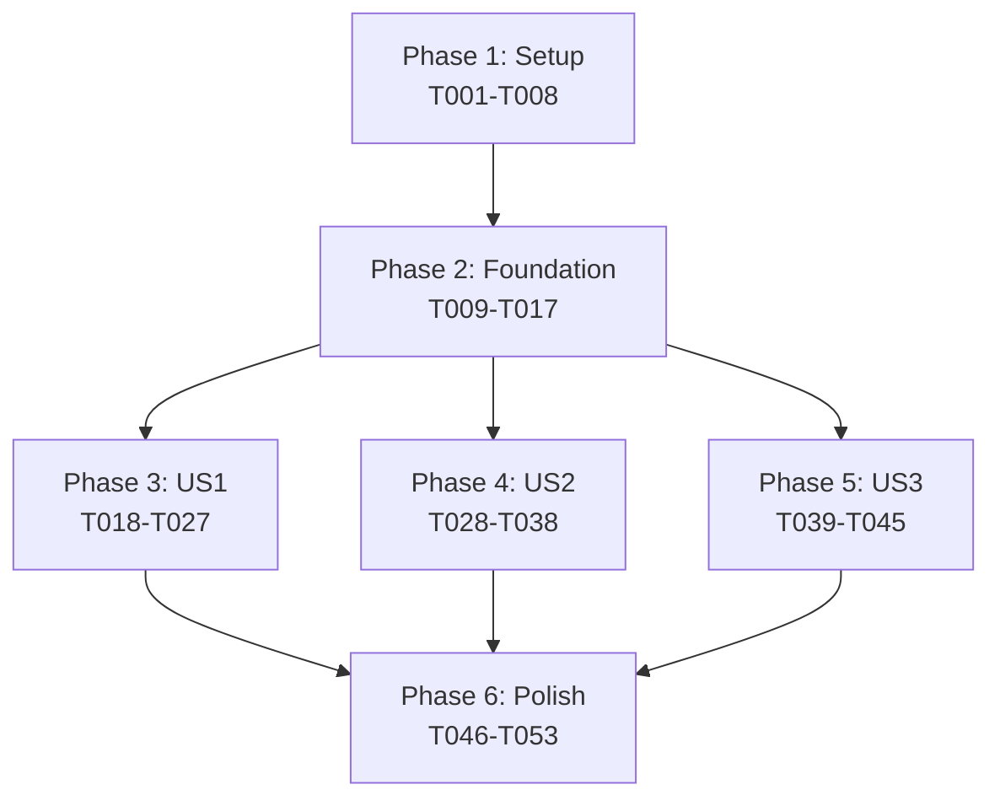

# MCP Node Integration - 実装タスクリスト

**Feature**: 001-mcp-node
**Branch**: feature/001-mcp-node
**Date**: 2024-11-15
**Spec**: specs/001-mcp-node/spec.md
**Plan**: [specs/001-mcp-node/plan.md](./plan.md)

## 進捗管理

**重要**: タスク完了時は、`- [ ]` を `- [x]` に変更してマークしてください。

例:
```markdown
- [ ] T001 未完了のタスク
- [x] T002 完了したタスク
```

これにより、実装の進捗を可視化できます。

## Phase 1: セットアップ (Setup) - 2日

プロジェクトの基盤構造とビルド環境の準備

- [x] T001 [P] 機能ブランチ feature/001-mcp-node を作成
- [x] T002 [P] 型定義ファイル src/types/mcp-node.ts を作成
- [x] T003 [P] MCPノード用ディレクトリ src/extension/nodes/mcp/ を作成
- [x] T004 [P] Webview用MCPコンポーネントディレクトリ src/webview/src/components/nodes/McpNode/ を作成
- [x] T005 package.json に child_process 型定義を追加（既存の場合はスキップ）
- [x] T006 contracts/mcp-cli.schema.json をプロジェクトに配置
- [x] T007 contracts/workflow-mcp-node.schema.json をプロジェクトに配置
- [x] T008 contracts/extension-webview-messages.schema.json をプロジェクトに配置

## Phase 2: 基盤実装 (Foundational) - 3日

全ユーザーストーリーの前提となる共通基盤の実装

- [x] T009 McpNode型定義を実装 in src/types/mcp-node.ts
- [x] T010 McpNodeData型定義を実装 in src/types/mcp-node.ts
- [x] T011 McpServerReference型定義を実装 in src/types/mcp-node.ts
- [x] T012 McpToolReference型定義を実装 in src/types/mcp-node.ts
- [x] T013 ToolParameter型定義を実装 in src/types/mcp-node.ts
- [x] T014 MCP CLIラッパークラスを実装 in src/extension/services/mcp-cli-service.ts
- [x] T015 MCPサーバー情報キャッシュ機構を実装 in src/extension/services/mcp-cache-service.ts
- [x] T016 Extension-Webview間メッセージ型を定義 in src/types/messages/mcp-messages.ts
- [x] T017 ワークフロー検証ルールを拡張(MCPノード対応) in src/extension/utils/validate-workflow.ts

## Phase 3: ユーザーストーリー1実装 (US1: MCP Tool Discovery) - 5日

**ストーリーゴール**: ユーザーがMCPツールを検索・選択できる

**独立テスト基準**:
- MCP CLIコマンドが実行され、ツールリストが表示される
- ツール検索・フィルタリングが動作する
- 選択したツールでMCPノードが作成される

- [x] T018 [US1] MCP_LIST_SERVERSメッセージハンドラを実装 in src/extension/commands/mcp-handlers.ts
- [x] T019 [US1] MCP_LIST_TOOLSメッセージハンドラを実装 in src/extension/commands/mcp-handlers.ts
- [x] T020 [US1] listServers()メソッドを実装（claude mcp list実行） in src/extension/services/mcp-cli-service.ts
- [x] T021 [US1] listTools()メソッドを実装（MCP SDK直接接続で実装） in src/extension/services/mcp-cli-service.ts
- [x] T022 [US1] MCPサーバーリストUIコンポーネントを実装 in src/webview/src/components/mcp/McpServerList.tsx
- [x] T023 [US1] MCPツールリストUIコンポーネントを実装 in src/webview/src/components/mcp/McpToolList.tsx
- [x] T024 [US1] ツール検索・フィルタリング機能を実装 in src/webview/src/components/mcp/McpToolSearch.tsx
- [x] T025 [US1] MCPノード作成ダイアログを実装 in src/webview/src/components/dialogs/McpNodeDialog.tsx
- [x] T026 [US1] workflow-storeにMCPノード追加アクションを実装 in src/webview/src/stores/workflow-store.ts
- [x] T027 [US1] MCPノードのReact Flowカスタムノードを実装 in src/webview/src/components/nodes/McpNode/McpNode.tsx
- [x] T027.5 [E2E] MVP機能テスト - MCPツール検索・選択・ノード作成の疎通確認
  - MCPサーバーリストの取得と表示
  - ツールリストの取得と表示
  - ツール検索・フィルタリング
  - MCPノード作成ダイアログの動作
  - MCPノードのキャンバス配置
  - エラーハンドリング(サーバー未接続時)

## Phase 4: ユーザーストーリー2実装 (US2: Parameter Configuration) - 4日

**ストーリーゴール**: ユーザーがMCPツールのパラメータを設定できる

**独立テスト基準**:
- パラメータスキーマが正しく取得される
- 動的フォームが生成され、バリデーションが動作する
- パラメータ値が保存・復元される

- [x] T028 [US2] MCP_GET_TOOL_SCHEMAメッセージハンドラを実装 in src/extension/commands/mcp-handlers.ts
- [x] T029 [US2] getToolSchema()メソッドを実装 in src/extension/services/mcp-cli-service.ts
- [x] T030 [US2] JSON Schemaパーサーを実装 in src/extension/utils/schema-parser.ts
- [x] T031 [US2] パラメータフォーム生成器を実装 in src/webview/src/components/mcp/ParameterFormGenerator.tsx
- [x] T032 [US2] 文字列型パラメータ入力コンポーネントを実装 in src/webview/src/components/mcp/parameters/StringParameter.tsx
- [x] T033 [US2] 数値型パラメータ入力コンポーネントを実装 in src/webview/src/components/mcp/parameters/NumberParameter.tsx
- [x] T034 [US2] ブール型パラメータ入力コンポーネントを実装 in src/webview/src/components/mcp/parameters/BooleanParameter.tsx
- [x] T035 [US2] 配列型パラメータ入力コンポーネントを実装 in src/webview/src/components/mcp/parameters/ArrayParameter.tsx
- [x] T036 [US2] オブジェクト型パラメータ入力コンポーネントを実装 in src/webview/src/components/mcp/parameters/ObjectParameter.tsx
- [x] T037 [US2] パラメータバリデーション機能を実装 in src/webview/src/utils/parameter-validator.ts
- [x] T038 [US2] MCPノード編集ダイアログを実装 in src/webview/src/components/dialogs/McpNodeEditDialog.tsx
- [x] T038.5 [E2E] パラメータ設定機能テスト - 動的フォーム生成・バリデーションの疎通確認
  - ツールスキーマの取得
  - 各型パラメータの入力UI表示(string, number, boolean, array, object)
  - パラメータバリデーション
  - MCPノード編集ダイアログの動作
  - パラメータ値の保存・復元

## Phase 5: ユーザーストーリー3実装 (US3: Workflow Integration) - 2日

**🔄 Phase 5再計画実施日**: 2025-11-15

**再計画の理由**:
当初のタスク設計は「ワークフロー実行機能」の実装を想定していたが、調査の結果、このプロジェクトはワークフロー**編集**に特化したエディタであり、実行機能は持たないことが判明。ワークフローはSlash Command形式でエクスポートされ、Claude Code CLIが実行する設計。

**変更内容**:
- タスク数: 7個 → 3個に削減(T039-T045 → T039-T041)
- 期間: 3日 → 2日に短縮
- 削除タスク: T042(executeTool実装), T043(結果パース), T044(実行状態表示) - すべて実行機能関連
- 変更タスク: T039(シリアライズ → エクスポート), T040(デシリアライズ → 国際化)
- 新規タスク: T041(検証拡張), T041.5(統合テスト)

**ストーリーゴール**: MCPノードを含むワークフローをエクスポートして実行可能にする

**背景説明**:
このプロジェクトはワークフロー編集に特化しており、実行機能は持たない。
ワークフローはSlash Command形式でエクスポートされ、Claude Code CLIが実行する。
したがって、MCPノードの"実行"とは「エクスポート時に適切な実行指示を生成すること」を意味する。

**独立テスト基準**:
- MCPノードがワークフローJSONに正しく保存・読み込みされる
- MCPノードがSlash Commandファイルに正しくエクスポートされる
- エクスポートされたファイルでMCPツールが実行可能(Claude Code CLI経由)
- バリデーションが正しく動作する

- [x] T039 [US3] MCPノードのエクスポート処理を実装 in src/extension/services/export-service.ts
  - generateMermaidFlowchart()にMCPノードのサポート追加
  - generateWorkflowExecutionLogic()にMCPノード実行指示追加
  - checkExistingFiles()は修正不要(MCPノード独自ファイル不要)
- [x] T040 [US3] MCPノードの国際化対応を実装 in src/extension/i18n/translations/*.ts
  - Mermaidフローチャート用ラベル追加
  - 実行ガイド用テキスト追加(5言語: en, ja, ko, zh-CN, zh-TW)
- [x] T041 [US3] ワークフロー保存時のMCPノード検証を拡張 in src/extension/utils/validate-workflow.ts
  - MCPノードの検証ルール確認・必要に応じて強化
  - エラーメッセージの国際化確認
- [x] T041.5 [E2E] ワークフロー統合テスト - MCPノード含むワークフローの疎通確認
  - MCPノード含むワークフローの保存・読み込み
  - ワークフローのエクスポート
  - エクスポートされたSlash Commandファイルの内容確認
  - バリデーションエラーの表示確認
  - 国際化対応確認(5言語)

## Phase 6: 仕上げと横断的関心事 (Polish & Cross-Cutting) - 1日

**🔄 Phase 6再計画実施日**: 2025-11-15

**再計画の理由**:
1. CHANGELOG.mdはGitHub Actionsで自動更新されるため、手動更新は不要
2. アイコンは諸刃の剣で逆に意味が分かりづらくなる可能性があり、慎重な検討が必要

**変更内容**:
- タスク数: 4個 → 2個に削減(T042, T044を削除)
- 削除タスク:
  - T042(アイコン・スタイリング改善) - 慎重な検討が必要なため今回は見送り
  - T044(CHANGELOG.md更新) - GitHub Actionsで自動化

最終統合、ドキュメント化
- [x] T043 README.mdにMCPノード機能の説明を追加 in README.md
  - MCPノードの概要説明
  - 使用方法(検索・選択・パラメータ設定・エクスポート)
  - スクリーンショット(オプション)
  - package.jsonのdescriptionとkeywordsにMCP追加
- [x] T044.5 [E2E] 総合テスト - 全機能の統合疎通確認
  - 全機能の統合動作確認(MVP + パラメータ設定 + エクスポート)
  - 国際化対応確認(5言語: en, ja, ko, zh-CN, zh-TW)
  - パフォーマンス確認(キャッシュ動作、CLI呼び出し時間)
  - エラーハンドリング網羅確認
  - ドキュメント整合性確認(README)
  - リリース前最終チェック

**削除されたタスク**:
- T042 アイコン・スタイリング改善 → 慎重な検討が必要なため今回は見送り (Phase 6再計画により削除)
- T044 CHANGELOG.md更新 → GitHub Actionsで自動化 (Phase 6再計画により削除)
- T050 MCP実行ログ出力 → エクスポート時のログは不要 (Phase 5再計画により削除)
- T051 ワークフローテンプレート → 基本機能実装後に検討 (Phase 5再計画により削除)

## 依存関係 (Dependencies)



### 並列実行可能タスク

**Phase 1 (Setup)**:
- T001-T004は完全並列実行可能

**Phase 3 (US1)**:
- T022-T024（UIコンポーネント）は並列開発可能

**Phase 4 (US2)**:
- T032-T036（パラメータコンポーネント）は並列開発可能

**Phase 6 (Polish)**:
- T046-T047は並列実行可能

## 実装戦略 (Implementation Strategy)

### MVP優先アプローチ

**MVPスコープ（Phase 1-3）**:
- 基本的なMCPツール検索と選択機能
- シンプルなMCPノード作成
- 最小限のUI実装

**段階的デリバリー** (Phase 5再計画後):
1. ✅ **Week 1**: Setup + Foundation (T001-T017) - 完了
2. ✅ **Week 2**: US1実装でMVP完成 (T018-T027) - 完了
3. ✅ **Week 3**: US2実装でパラメータ設定追加 (T028-T038) - 完了
4. **Week 4**: US3実装でワークフロー統合 (T039-T041) - 2日
5. **Week 5**: Polish & 最終調整 (T042-T044) - 1日

### リスク軽減策

1. **MCP CLI依存性**: T014で早期にCLI接続を検証
2. **パフォーマンス**: T015でキャッシュ機構を早期実装
3. **UI複雑性**: Phase 3で最小限UIから始め、段階的に機能追加

### 成功指標

- [x] MVPリリース: Phase 3完了時点 (T027.5 E2Eテスト合格) ✅
- [x] パラメータ設定リリース: Phase 4完了時点 (T038.5 E2Eテスト合格) ✅
- [x] フル機能リリース: Phase 5完了時点 (T041.5 E2Eテスト合格) ✅
- [x] ユーザー満足度: Phase 6のPolish完了後 (T044.5 総合テスト合格) ✅

### E2Eテストタイミング

機能追加の疎通確認を確実に行うため、各Phase完了時に手動E2Eテストを実施:

1. ✅ **T027.5**: MVP機能テスト (Phase 3完了後) - 完了
2. ✅ **T038.5**: パラメータ設定機能テスト (Phase 4完了後) - 完了
3. ✅ **T041.5**: ワークフロー統合テスト (Phase 5完了後) - エクスポート機能確認 - 完了
4. ✅ **T044.5**: 総合テスト (Phase 6完了後、リリース前) - 全機能確認 - 完了

---

**注記**: このタスクリストは実装の進捗に応じて更新されます。各タスクの完了時には、チェックボックスをマークし、必要に応じて新たな課題や改善点を追記してください。