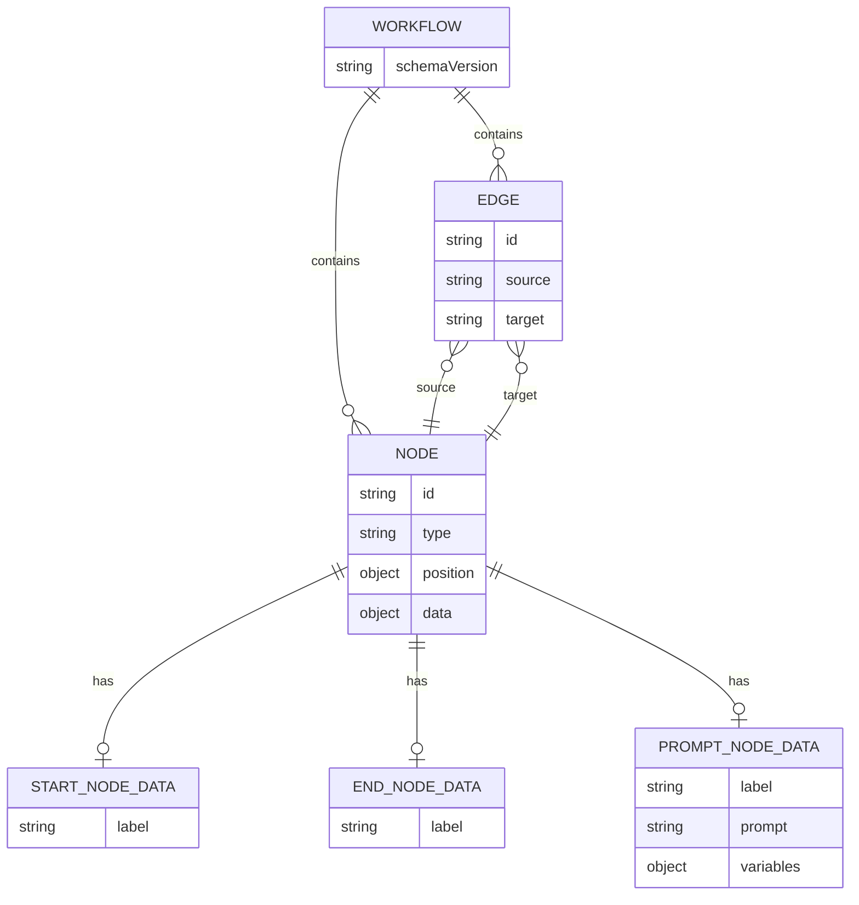

# Data Model: ノードタイプ拡張

**Feature**: 001-node-types-extension
**Date**: 2025-11-01
**Status**: Complete

## Overview

このドキュメントでは、Start/End/Promptノードの追加に伴うデータモデルの定義を行います。既存のReactFlowノードデータ構造を拡張し、型安全性を維持しながら実装します。

## 1. Node Type Definitions

### StartNode

**Purpose**: ワークフローの開始点を明示的に表現する。

**TypeScript Definition**:

```typescript
import { Node } from 'reactflow';

export interface StartNodeData {
  /**
   * ノードのラベル (省略可能)
   * デフォルト: "Start"
   */
  label?: string;
}

export type StartNode = Node<StartNodeData, 'start'>;
```

**Properties**:

| Property | Type   | Required | Default | Description                |
|----------|--------|----------|---------|----------------------------|
| label    | string | No       | "Start" | ノードに表示されるラベルテキスト |

**Validation Rules**:

- `label`が空文字列の場合、デフォルト値"Start"を使用
- 1ワークフローに複数のStartノードが存在することを許可 (ただし警告を表示)

**State Transitions**: N/A (Startノードは状態を持たない)

---

### EndNode

**Purpose**: ワークフローの終了点を明示的に表現する。

**TypeScript Definition**:

```typescript
import { Node } from 'reactflow';

export interface EndNodeData {
  /**
   * ノードのラベル (省略可能)
   * デフォルト: "End"
   */
  label?: string;
}

export type EndNode = Node<EndNodeData, 'end'>;
```

**Properties**:

| Property | Type   | Required | Default | Description                |
|----------|--------|----------|---------|----------------------------|
| label    | string | No       | "End"   | ノードに表示されるラベルテキスト |

**Validation Rules**:

- `label`が空文字列の場合、デフォルト値"End"を使用
- 1ワークフローに複数のEndノードが存在することを許可

**State Transitions**: N/A (Endノードは状態を持たない)

---

### PromptNode

**Purpose**: AIエージェントに送信するプロンプトテキストを定義する。

**TypeScript Definition**:

```typescript
import { Node } from 'reactflow';

export interface PromptNodeData {
  /**
   * ノードのラベル (省略可能)
   * デフォルト: "Prompt"
   */
  label?: string;

  /**
   * プロンプトテキスト (必須)
   * Mustache形式の変数 ({{variableName}}) をサポート
   */
  prompt: string;

  /**
   * プレースホルダー変数のマッピング (省略可能)
   * 実行時に前段のノードから値を受け取る
   */
  variables?: Record<string, string>;
}

export type PromptNode = Node<PromptNodeData, 'prompt'>;
```

**Properties**:

| Property  | Type                     | Required | Default          | Description                                        |
|-----------|--------------------------|----------|------------------|----------------------------------------------------|
| label     | string                   | No       | "Prompt"         | ノードに表示されるラベルテキスト                   |
| prompt    | string                   | Yes      | ""               | AIエージェントに送信するプロンプト (最大10,000文字) |
| variables | Record<string, string>   | No       | `{}`             | プレースホルダー変数のキー・値マッピング            |

**Validation Rules**:

- `prompt`が空文字列の場合、エラーメッセージを表示 (ノードは保存できない)
- `prompt`の長さが10,000文字を超える場合、警告を表示
- `variables`に存在しないプレースホルダーがprompt内に含まれる場合、実行時にプレースホルダーをそのまま残す

**State Transitions**:

1. **Draft**: プロンプトが空、または編集中
2. **Valid**: プロンプトが入力され、保存可能
3. **Executing**: ワークフロー実行中にこのノードが処理されている
4. **Completed**: プロンプトが正常に処理された

---

## 2. Workflow File Schema

### Current Schema (v1.0.0)

既存のワークフローファイル形式 (新規ノードタイプ非対応):

```json
{
  "nodes": [
    {
      "id": "node-1",
      "type": "default",
      "position": { "x": 100, "y": 100 },
      "data": { "label": "Node 1" }
    }
  ],
  "edges": [
    {
      "id": "edge-1",
      "source": "node-1",
      "target": "node-2"
    }
  ]
}
```

### New Schema (v1.1.0)

新規ノードタイプをサポートする形式:

```json
{
  "schemaVersion": "1.1.0",
  "nodes": [
    {
      "id": "start-1",
      "type": "start",
      "position": { "x": 50, "y": 150 },
      "data": { "label": "Start" }
    },
    {
      "id": "prompt-1",
      "type": "prompt",
      "position": { "x": 250, "y": 150 },
      "data": {
        "label": "Generate Code",
        "prompt": "Generate a {{language}} function that {{description}}",
        "variables": {
          "language": "TypeScript",
          "description": "validates email addresses"
        }
      }
    },
    {
      "id": "end-1",
      "type": "end",
      "position": { "x": 450, "y": 150 },
      "data": { "label": "End" }
    }
  ],
  "edges": [
    {
      "id": "edge-1",
      "source": "start-1",
      "target": "prompt-1"
    },
    {
      "id": "edge-2",
      "source": "prompt-1",
      "target": "end-1"
    }
  ]
}
```

**Key Changes**:

1. 追加: `schemaVersion`フィールド (string, optional)
2. 新規ノードタイプ: `start`, `end`, `prompt`

**Backward Compatibility**:

- `schemaVersion`が存在しない場合、`v1.0.0`として扱う
- v1.0.0形式のファイルは引き続き読み込み可能
- 新規ノードタイプを含むワークフローを古いバージョンで開こうとした場合、警告を表示し、未知のノードを"generic"タイプとして読み込む

---

## 3. Entity Relationships



**Relationships**:

- 1つのWorkflowは複数のNodeとEdgeを持つ (1:N)
- 1つのNodeは0または1つのノードタイプ固有のDataを持つ (1:0..1)
- 1つのEdgeは必ず1つのsource Nodeと1つのtarget Nodeを持つ (N:1)

**Constraints**:

- Startノードは入力Edgeを持たない (または警告)
- Endノードは出力Edgeを持たない (または警告)
- PromptNodeのpromptフィールドは空であってはならない

---

## 4. State Management (Zustand Store)

### Store Interface Extension

既存の`WorkflowStore`に新規ノードタイプ関連のメソッドは不要。既存の`addNode`, `updateNodeData`, `removeNode`メソッドをそのまま使用。

**Reason**: ReactFlowのノードは汎用的な`Node<T>`型であり、新規ノードタイプも既存のストア操作で扱える。

### Example Usage

```typescript
import { useWorkflowStore } from './stores/workflow-store';
import { nanoid } from 'nanoid';

// Startノードを追加
const addStartNode = () => {
  const newNode: StartNode = {
    id: nanoid(),
    type: 'start',
    position: { x: 100, y: 100 },
    data: { label: 'Start' }
  };

  useWorkflowStore.getState().addNode(newNode);
};

// Promptノードのプロンプトを更新
const updatePrompt = (nodeId: string, newPrompt: string) => {
  useWorkflowStore.getState().updateNodeData(nodeId, { prompt: newPrompt });
};
```

---

## 5. Validation & Error Handling

### Client-Side Validation

**Validation Timing**:

1. **Input Validation**: ノード設定ダイアログでの入力時
2. **Save Validation**: ワークフロー保存時
3. **Execution Validation**: ワークフロー実行開始時

**Validation Rules**:

| Rule ID | Entity      | Rule                                      | Severity | Message                                          |
|---------|-------------|-------------------------------------------|----------|--------------------------------------------------|
| VR-001  | PromptNode  | prompt field must not be empty            | Error    | "プロンプトを入力してください"                   |
| VR-002  | PromptNode  | prompt length must be <= 10,000 chars     | Warning  | "プロンプトが長すぎます (最大10,000文字)"        |
| VR-003  | StartNode   | no incoming edges                         | Warning  | "開始ノードに入力接続があります"                 |
| VR-004  | EndNode     | no outgoing edges                         | Warning  | "終了ノードに出力接続があります"                 |
| VR-005  | Workflow    | at least one node must exist              | Error    | "ワークフローにノードがありません"               |

### Error States

PromptNodeの場合のみ、以下のエラー状態を持つ:

```typescript
enum PromptNodeError {
  EmptyPrompt = 'EMPTY_PROMPT',
  PromptTooLong = 'PROMPT_TOO_LONG',
  InvalidVariable = 'INVALID_VARIABLE'
}
```

---

## 6. Migration Strategy

### From v1.0.0 to v1.1.0

**Automatic Migration**: ユーザーが新規ノードタイプを初めて使用した時点で、`schemaVersion: "1.1.0"`を自動的に付与。

**Manual Migration**: 不要 (既存ファイルはそのまま動作)

**Rollback**: `schemaVersion`フィールドを削除すれば、v1.0.0形式に戻る (新規ノードタイプは失われる)

---

## Summary

新規ノードタイプのデータモデルは、既存のReactFlowノード構造を拡張する形で実装されます。型安全性を維持しつつ、下位互換性も確保しています。PromptNodeのみ追加のバリデーションロジックが必要ですが、Start/EndNodeは最小限のデータ構造で実装可能です。
