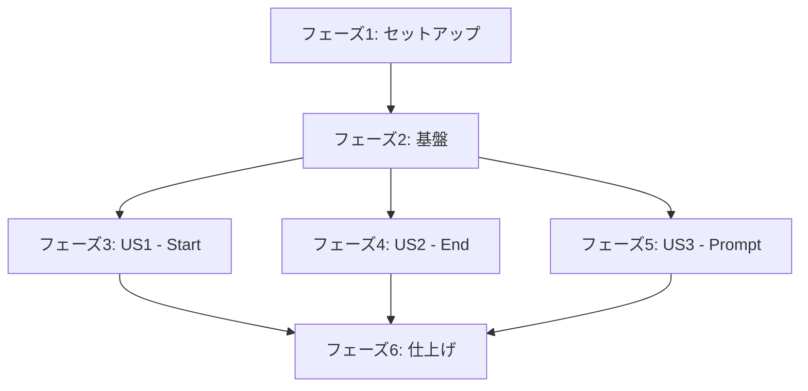

# タスク: ノードタイプ拡張

**入力**: `/specs/001-node-types-extension/` 配下の設計ドキュメント
**前提条件**: plan.md, spec.md, research.md, data-model.md, quickstart.md

**テスト**: 憲章要件に従いテストタスクを含む (TDD、カバレッジ目標85%)

**構成**: ユーザーストーリーごとにタスクをグループ化し、各ストーリーを独立して実装・テスト可能にする

## 進捗管理

**重要**: タスク完了時は、`- [ ]` を `- [x]` に変更してマークしてください。

例:
```markdown
- [ ] T001 未完了のタスク
- [x] T002 完了したタスク
```

これにより、実装の進捗を可視化できます。

## フォーマット: `[ID] [P?] [Story] 説明`

- **[P]**: 並行実行可能 (異なるファイル、依存関係なし)
- **[Story]**: このタスクが属するユーザーストーリー (例: US1, US2, US3)
- 説明には正確なファイルパスを含める

## パス規約

- VSCode Extension構造: `src/extension/`, `src/webview/`, `src/shared/`
- テスト: `src/webview/tests/unit/`, `src/webview/tests/integration/`, `tests/e2e/`

---

## フェーズ1: セットアップ (共通インフラ)

**目的**: 型定義と共通インフラの準備

- [x] T001 ノードタイプ定義ファイルを作成 src/webview/src/types/node-types.ts
- [x] T002 [P] WorkflowFileインターフェースにschemaVersionフィールドを追加 src/shared/types.ts
- [x] T003 [P] 新規ノードタイプ用のCSSスタイルシートを作成 src/webview/src/styles/nodes.css

---

## フェーズ2: 基盤 (ブロッキング前提条件)

**目的**: 全ユーザーストーリーが依存する基盤機能

**⚠️ 重要**: このフェーズ完了まで、ユーザーストーリー実装を開始できません

- [x] T004 プレースホルダー変数抽出ユーティリティを実装 src/webview/src/utils/template-utils.ts
- [x] T005 プレースホルダー変数置換ユーティリティを実装 src/webview/src/utils/template-utils.ts
- [x] T006 [P] ReactFlowコンポーネントにnodeTypes登録ロジックを追加 src/webview/src/App.tsx
- [x] T007 [P] 接続制約用のisValidConnectionコールバックを実装 src/webview/src/App.tsx

**チェックポイント**: 基盤準備完了 - ユーザーストーリー実装を並行開始可能

---

## フェーズ3: ユーザーストーリー1 - Startノード実装 (優先度: P1) 🎯 MVP

**目標**: ワークフローの開始点を明示的に定義できるようにする

**独立テスト**: Startノードをパレットから配置し、視覚的に開始点として識別でき、他のノードへ接続できることを確認

### ユーザーストーリー1のテスト

> **注意: 実装前にこれらのテストを最初に書き、失敗することを確認してください**

- [ ] T008 [P] [US1] ユニットテスト: StartNodeがデフォルトラベルで描画される src/webview/tests/unit/nodes/StartNode.test.tsx
- [ ] T009 [P] [US1] ユニットテスト: StartNodeがカスタムラベルで描画される src/webview/tests/unit/nodes/StartNode.test.tsx
- [ ] T010 [P] [US1] ユニットテスト: StartNodeが正しいARIA属性を持つ src/webview/tests/unit/nodes/StartNode.test.tsx
- [ ] T011 [P] [US1] 統合テスト: StartNodeをワークフローに追加できる src/webview/tests/integration/workflow.test.ts
- [ ] T012 [P] [US1] 統合テスト: StartNodeの接続制約が動作する src/webview/tests/integration/workflow.test.ts

### ユーザーストーリー1の実装

- [x] T013 [P] [US1] StartNodeコンポーネントを実装 src/webview/src/components/nodes/StartNode.tsx
- [x] T014 [P] [US1] StartNodeのスタイルをnodes.cssに追加 (タスクT003が完了している必要あり)
- [x] T015 [US1] StartNodeをnodeTypesマッピングに登録 src/webview/src/App.tsx (T013に依存)
- [x] T016 [US1] StartNodeテンプレートをNodePaletteに追加 src/webview/src/components/NodePalette.tsx
- [x] T017 [US1] StartNodeの接続制約をisValidConnectionコールバックに追加 (入力接続を防止)
- [ ] T018 [US1] StartNodeのE2Eテスト: パレットから追加、接続、保存、再読込 tests/e2e/node-types.test.ts

**チェックポイント**: ユーザーストーリー1完了 - Startノードが完全に機能し、独立してテスト可能

---

## フェーズ4: ユーザーストーリー2 - Endノード実装 (優先度: P1)

**目標**: ワークフローの終了点を明示的に定義できるようにする

**独立テスト**: Endノードをパレットから配置し、視覚的に終了点として識別でき、他のノードから接続できることを確認

### ユーザーストーリー2のテスト

> **注意: 実装前にこれらのテストを最初に書き、失敗することを確認してください**

- [ ] T019 [P] [US2] ユニットテスト: EndNodeがデフォルトラベルで描画される src/webview/tests/unit/nodes/EndNode.test.tsx
- [ ] T020 [P] [US2] ユニットテスト: EndNodeがカスタムラベルで描画される src/webview/tests/unit/nodes/EndNode.test.tsx
- [ ] T021 [P] [US2] ユニットテスト: EndNodeが正しいARIA属性を持つ src/webview/tests/unit/nodes/EndNode.test.tsx
- [ ] T022 [P] [US2] 統合テスト: EndNodeをワークフローに追加できる src/webview/tests/integration/workflow.test.ts
- [ ] T023 [P] [US2] 統合テスト: EndNodeの接続制約が動作する src/webview/tests/integration/workflow.test.ts
- [ ] T024 [P] [US2] 統合テスト: 複数のEndNodeが共存できる src/webview/tests/integration/workflow.test.ts

### ユーザーストーリー2の実装

- [ ] T025 [P] [US2] EndNodeコンポーネントを実装 src/webview/src/components/nodes/EndNode.tsx
- [ ] T026 [P] [US2] EndNodeのスタイルをnodes.cssに追加 (タスクT003が完了している必要あり)
- [ ] T027 [US2] EndNodeをnodeTypesマッピングに登録 src/webview/src/App.tsx (T025に依存)
- [ ] T028 [US2] EndNodeテンプレートをNodePaletteに追加 src/webview/src/components/NodePalette.tsx
- [ ] T029 [US2] EndNodeの接続制約をisValidConnectionコールバックに追加 (出力接続を防止)
- [ ] T030 [US2] EndNodeのE2Eテスト: パレットから追加、接続、保存、再読込 tests/e2e/node-types.test.ts

**チェックポイント**: ユーザーストーリー2完了 - Endノードが完全に機能し、独立してテスト可能

---

## フェーズ5: ユーザーストーリー3 - Promptノード実装 (優先度: P2)

**目標**: AIエージェント用のプロンプトテキストを定義できるようにする

**独立テスト**: Promptノードをパレットから配置し、プロンプトテキストを入力・保存でき、プレースホルダー変数が動作することを確認

### ユーザーストーリー3のテスト

> **注意: 実装前にこれらのテストを最初に書き、失敗することを確認してください**

- [ ] T031 [P] [US3] ユニットテスト: PromptNodeがデフォルト状態で描画される src/webview/tests/unit/nodes/PromptNode.test.tsx
- [ ] T032 [P] [US3] ユニットテスト: PromptNodeでプロンプトテキストを編集できる src/webview/tests/unit/nodes/PromptNode.test.tsx
- [ ] T033 [P] [US3] ユニットテスト: PromptNodeが空プロンプトのバリデーションエラーを表示する src/webview/tests/unit/nodes/PromptNode.test.tsx
- [ ] T034 [P] [US3] ユニットテスト: PromptNodeがプレースホルダー変数を正しく抽出する src/webview/tests/unit/nodes/PromptNode.test.tsx
- [ ] T035 [P] [US3] 統合テスト: PromptNodeをワークフローに追加してプロンプトを保存できる src/webview/tests/integration/workflow.test.ts
- [ ] T036 [P] [US3] 統合テスト: プレースホルダー変数の置換が実行時に動作する src/webview/tests/integration/workflow.test.ts
- [ ] T037 [P] [US3] ユニットテスト: extractVariablesユーティリティ関数 src/webview/tests/unit/utils/template-utils.test.ts
- [ ] T038 [P] [US3] ユニットテスト: substituteVariablesユーティリティ関数 src/webview/tests/unit/utils/template-utils.test.ts

### ユーザーストーリー3の実装

- [ ] T039 [P] [US3] 編集/プレビューモード付きPromptNodeコンポーネントを実装 src/webview/src/components/nodes/PromptNode.tsx
- [ ] T040 [P] [US3] PromptNodeのスタイルをnodes.cssに追加 (タスクT003が完了している必要あり)
- [ ] T041 [US3] PromptNodeをnodeTypesマッピングに登録 src/webview/src/App.tsx (T039に依存)
- [ ] T042 [US3] PromptNodeテンプレートをNodePaletteに追加 src/webview/src/components/NodePalette.tsx
- [ ] T043 [US3] プロンプト検証ロジックを実装 (空チェック、長さチェック) PromptNodeコンポーネント内
- [ ] T044 [US3] template-utilsを使用してPromptNodeにプレースホルダー変数抽出を統合
- [ ] T045 [US3] テキストエリアと保存/キャンセルボタン付きプロンプト編集UIを実装
- [ ] T046 [US3] PromptNodeのE2Eテスト: パレットから追加、プロンプト編集、保存、再読込 tests/e2e/node-types.test.ts

**チェックポイント**: ユーザーストーリー3完了 - Promptノードが完全に機能し、独立してテスト可能

---

## フェーズ6: 仕上げと横断的関心事

**目的**: 全ユーザーストーリーにまたがる品質向上と統合

- [ ] T047 ワークフローファイルローダーにschemaVersion自動アップグレードロジックを実装 src/webview/src/services/workflow-service.ts
- [ ] T048 v1.0.0ワークフローファイルの下位互換性チェックを追加 src/webview/src/services/workflow-service.ts
- [ ] T049 [P] 複数のStartノードに対する警告メッセージをワークフロー検証に追加
- [ ] T050 [P] Start/Endノード不足に対する警告メッセージをワークフロー検証に追加
- [ ] T051 [P] README.mdに新しいノードタイプのドキュメントを追加
- [ ] T052 [P] CHANGELOG.mdにv1.1.0のリリースノートを追加
- [ ] T053 npm test && npm run lintを実行してすべてのテストが通過しコード品質を確認
- [ ] T054 新規コードのテストカバレッジが85%目標を満たすことを確認
- [ ] T055 3つのノードタイプすべてを使った手動E2Eテストを実施
- [ ] T056 パフォーマンステスト: 新ノードタイプでエディタ起動時間が500ms未満であることを確認

**最終チェックポイント**: すべてのユーザーストーリー完了、仕上げ適用済み、デプロイ準備完了

---

## 依存関係



**並行実行の機会**:

- **フェーズ2完了後**: US1 (Start)、US2 (End)、US3 (Prompt)を並行実装可能
- **各ユーザーストーリー内**: ほとんどのテストタスクを並行実行可能 ([P]マーク付き)
- **各ユーザーストーリー内**: スタイルタスクとコンポーネントタスクを並行実行可能

**MVPスコープ** (Minimum Viable Product):

- フェーズ1: セットアップ
- フェーズ2: 基盤
- フェーズ3: ユーザーストーリー1 (Startノードのみ)

これによりワークフロー開始点を明示的に定義するというコア価値を提供します。

---

## 実装戦略

### MVP優先アプローチ

1. **スプリント1** (MVP): フェーズ1 + フェーズ2 + フェーズ3 (ユーザーストーリー1)
   - 提供: Startノードの完全実装
   - 価値: ワークフローの開始点が明示的になる

2. **スプリント2**: フェーズ4 (ユーザーストーリー2)
   - 提供: Endノードの追加
   - 価値: ワークフローの終了点も明示的になり、フローが完全に可視化される

3. **スプリント3**: フェーズ5 (ユーザーストーリー3)
   - 提供: Promptノードの追加
   - 価値: AI統合ワークフローの基盤が整う

4. **スプリント4**: フェーズ6 (仕上げ)
   - 提供: 品質向上、ドキュメント整備
   - 価値: プロダクション準備完了

### 段階的デリバリー

各ユーザーストーリーは独立してテスト・デリバリー可能なため、以下のようにリリースできます:

- **v1.1.0-alpha.1**: Startノードのみ (MVP)
- **v1.1.0-alpha.2**: Start + Endノード
- **v1.1.0-beta**: Start + End + Promptノード
- **v1.1.0**: 全機能 + ポリッシュ

---

## タスク概要

- **総タスク数**: 56
- **セットアップフェーズ**: 3タスク
- **基盤フェーズ**: 4タスク (ブロッキング)
- **ユーザーストーリー1** (Startノード): 11タスク (テスト6 + 実装5)
- **ユーザーストーリー2** (Endノード): 12タスク (テスト6 + 実装6)
- **ユーザーストーリー3** (Promptノード): 16タスク (テスト8 + 実装8)
- **仕上げフェーズ**: 10タスク

**並行実行可能タスク数**: 36タスクに[P]マークがあり、各フェーズ内で並行実行可能

**テストカバレッジ**:
- ユニットテスト: 13タスク
- 統合テスト: 7タスク
- E2Eテスト: 3タスク
- テストタスク合計: 23 (全タスクの41%)

**フォーマット検証**: ✅ 全56タスクがチェックボックス、ID、[P]マーカー(該当する場合)、[Story]ラベル、正確なファイルパスを含む必須チェックリスト形式に従っています

---

## 次のステップ

1. フェーズ1(セットアップ)から開始 - これらは並行実行可能
2. フェーズ2(基盤)を完了 - 全USのブロッカー
3. MVPパス(US1のみ)または完全実装(US1+US2+US3を並行)を選択
4. 高いカバレッジを維持するため頻繁にテストを実行
5. 最終リリース前にフェーズ6(仕上げ)を完了

推定実装時間: 8-12時間 (MVP: 4-5時間, 全機能: 8-12時間)
